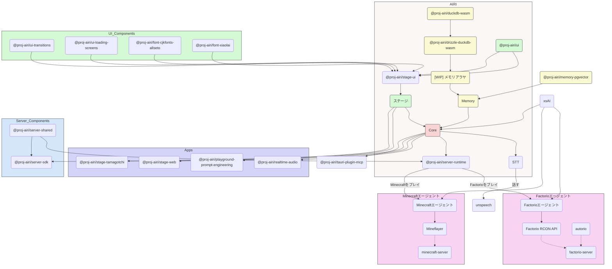

<picture>
  <source
    width="100%"
    srcset="./content/public/banner-dark-1280x640.avif"
    media="(prefers-color-scheme: dark)"
  />
  <source
    width="100%"
    srcset="./content/public/banner-light-1280x640.avif"
    media="(prefers-color-scheme: light), (prefers-color-scheme: no-preference)"
  />
  
</picture>

<h1 align="center">Project AIRI</h1>

<p align="center">Neuro-sama 재현, AI 와이푸(Waifu), AI 미소녀 / 버추얼 캐릭터의 영혼을 담을 그릇을 우리 곁으로. <br> Neuro-sama와 같은 버추얼 파트너도 이제, 우리 일상의 일부가 됩니다.</p>

<p align="center">
  [<a href="https://discord.gg/TgQ3Cu2F7A">Discord 서버 참가하기</a>] [<a href="https://airi.moeru.ai">체험하기</a>] [<a href="https://github.com/moeru-ai/airi/blob/main/README.md">English</a>] [<a href="https://github.com/moeru-ai/airi/blob/main/docs/README.zh-CN.md">简体中文</a>] [<a href="https://github.com/moeru-ai/airi/blob/main/docs/README.ja-JP.md">日本語</a>] [<a href="https://github.com/moeru-ai/airi/blob/main/docs/README.ru-RU.md">Русский</a>] [<a href="https://github.com/moeru-ai/airi/blob/main/docs/README.vi.md">Tiếng Việt</a>] [<a href="https://github.com/moeru-ai/airi/blob/main/docs/README.fr.md">Français</a>]
</p>

<p align="center">
  <a href="https://deepwiki.com/moeru-ai/airi"></a>
  <a href="https://github.com/moeru-ai/airi/blob/main/LICENSE"></a>
  <a href="https://discord.gg/TgQ3Cu2F7A"></a>
  <a href="https://x.com/proj_airi"></a>
  <a href="https://t.me/+7M_ZKO3zUHFlOThh"></a>
</p>

<p align="center">
  <a href="https://www.producthunt.com/products/airi?embed=true&utm_source=badge-featured&utm_medium=badge&utm_source=badge-airi" target="_blank"></a>
  <a href="https://trendshift.io/repositories/14636" target="_blank"></a>
</p>

> [Neuro-sama](https://www.youtube.com/@Neurosama)에서 깊은 영감을 받음

> [!WARNING]
> **주의：**
> 해당 프로젝트에서는 공식 암호화폐나 토큰 등을 **일절 발행하지 않습니다**. 잘못된 정보에 주의해 주세요.

> [!NOTE]
>
> Project AIRI에서 파생된 다양한 서브 프로젝트들을 모아둔 [@proj-airi](https://github.com/proj-airi) 조직도 있습니다. 한번 둘러보세요!
>
> RAG, 메모리 시스템, 임베디드 데이터베이스, 아이콘, Live2D 유틸리티 등 다양한 프로젝트가 있습니다!

함께 이야기하고 즐길 수 있는 가상의 존재(사이버 와이푸, 디지털 펫)나 디지털 컴패니언, 한 번쯤 꿈꿔보지 않으셨나요?

[ChatGPT](https://chatgpt.com)나 [Claude](https://claude.ai)와 같은 최신 거대언어모델(LLM)의 힘으로, 가상의 존재와 롤플레잉을 하거나 대화를 나누는 건 이제 누구나 쉽게 할 수 있게 되었습니다. [Character.ai(c.ai)](https://character.ai)나 [JanitorAI](https://janitorai.com/)와 같은 플랫폼, 그리고 [SillyTavern](https://github.com/SillyTavern/SillyTavern)과 같은 로컬 플레이그라운드는 채팅 기반의 대화나 시각적인 어드벤처 게임 같은 경험을 즐기기에 이미 충분한 해결책이 되고 있습니다.

> 하지만, 게임을 직접 플레이하는 능력은 어떨까요? 여러분이 코딩하는 화면을 함께 보고, 게임을 하며 수다를 떨거나, 영상을 같이 시청하는 등 다른 더 많은 것을 할 수 있는 능력은요?

아마 [Neuro-sama](https://www.youtube.com/@Neurosama)에 대해 들어본 적이 있을 겁니다. 현재 게임과 채팅은 물론, 시청자나 다른 참여자들과 상호작용이 가능한 현존하는 최고의 버추얼 스트리머죠. 누군가는 이러한 존재를 '디지털 휴먼'이라 부르기도 합니다. **하지만 아쉽게도 오픈소스로 공개되지 않았기에, 방송이 끝나면 더 이상 그녀와 만날 수 없습니다.**

따라서 Project AIRI는 여기서 새로운 가능성을 제시합니다: **언제 어디서나 손쉽게, 여러분만의 디지털 라이프와 가상의 존재를 온전히 소유할 수 있도록.**

## 게시된 DevLog  & 최신 업데이트

- [DevLog @ 2025.10.20](https://airi.moeru.ai/docs/en/blog/DevLog-2025.10.20/) — 2025/10/20
- [DevLog @ 2025.08.05](https://airi.moeru.ai/docs/en/blog/DevLog-2025.08.05/) — 2025/08/05
- [DevLog @ 2025.08.01](https://airi.moeru.ai/docs/en/blog/DevLog-2025.08.01/) — 2025/08/01
- [DevLog @ 2025.07.18](https://airi.moeru.ai/docs/en/blog/DevLog-2025.07.18/) — 2025/07/18
- [DreamLog 0x1](https://airi.moeru.ai/docs/en/blog/dreamlog-0x1/) — 2025/06/16
- ...더 자세한 내용은 [공식 사이트](https://airi.moeru.ai/docs/en/)를 참고하세요

## 이 프로젝트가 특별한 이유는?

다른 AI 기반 VTuber 오픈소스 프로젝트와 달리, 아이리(アイリ)는 개발 초기 단계부터 [WebGPU](https://www.w3.org/TR/webgpu/), [WebAudio](https://developer.mozilla.org/en-US/docs/Web/API/Web_Audio_API), [Web Workers](https://developer.mozilla.org/en-US/docs/Web/API/Web_Workers_API/Using_web_workers), [WebAssembly](https://webassembly.org/), [WebSocket](https://developer.mozilla.org/en-US/docs/Web/API/WebSocket) 등 다양한 웹 기술을 지원하도록 설계되었습니다.

> [!TIP]
> Web 기반 기술이라 성능 저하가 우려되시나요?
>
> 걱정하지 마세요. 브라우저 버전은 브라우저나 WebView에서의 잠재력을 보여주기 위한 것일 뿐, 프로젝트는 웹 환경에만 전적으로 의존하지 않습니다. AIRI 데스크톱 버전은 복잡한 의존성 관리 없이도 기본으로 [NVIDIA CUDA](https://developer.nvidia.com/cuda-toolkit)와 [Apple Metal](https://developer.apple.com/metal/)을 지원합니다 (HuggingFace와 [candle](https://github.com/huggingface/candle)에 감사를). 기술적 장단점을 고려하여, 그래픽과 레이아웃, 애니메이션, 그리고 플러그인 시스템(WIP)에는 부분적으로 웹 기술을 활용했습니다.

즉, **아이리(アイリ)는 최신 브라우저와 기기에서 구동 가능**하며, 모바일 기기에서도 실행됨을 의미합니다 (PWA 지원 포함). 이는 우리(개발자)들에겐 아이리(アイリ) VTuber의 기능을 한 차원 더 높일 수 있는 가능성을, 사용자에게는 TCP 연결 등 비 웹 기술이 필요한 기능까지 활용할 수 있는 유연성을 제공합니다. 예컨대 Discord 음성 채널에 접속하거나, 친구들과 Minecraft와 Factorio를 함께 즐기는 것이 가능합니다.

> [!NOTE]
>
> 私たちはまだ開発の初期段階にあり、才能ある開発者を探しています。アイリVTuberを現実のものにするために私たちを助けてください。
>
> Vue.js、TypeScript、またはこのプロジェクトに必要な開発ツールに慣れていなくても大丈夫です。アーティスト、デザイナー、または最初のライブストリームを立ち上げる手助けをすることもできます。
>
> ReactやSvelte、Solidの大ファンであっても歓迎します。アイリVTuberに見たい機能を追加したり、実験したい機能を追加するためのサブディレクトリを開くことができます。
>
> 私たちが探している分野（および関連プロジェクト）：
>
> - Live2Dモデラー
> - VRMモデラー
> - VRChatアバターデザイナー
> - コンピュータビジョン
> - 強化学習
> - 音声認識
> - 音声合成
> - ONNXランタイム
> - Transformers.js
> - vLLM
> - WebGPU
> - Three.js
> - WebXR（@moeru-ai組織の[別のプロジェクト](https://github.com/moeru-ai/chat)もチェックしてください）
>
> **興味があるなら、ここで自己紹介してみませんか？ [Would like to join part of us to build AIRI?](https://github.com/moeru-ai/airi/discussions/33)**

## 現在の進捗

可能なこと

- [x] 脳
  - [x] [Minecraft](https://www.minecraft.net)をプレイ
  - [x] [Factorio](https://www.factorio.com)をプレイ（進行中ですが、[PoCとデモが利用可能](https://github.com/moeru-ai/airi-factorio)）
  - [x] [Telegram](https://telegram.org)でチャット
  - [x] [Discord](https://discord.com)でチャット
  - [ ] メモリ
    - [x] ブラウザ内データベースサポート（DuckDB WASM | `pglite`）
    - [ ] メモリアラヤ（進行中）
  - [ ] ブラウザ内ローカル（WebGPU）推論
- [x] 耳
  - [x] ブラウザからの音声入力
  - [x] [Discord](https://discord.com)からの音声入力
  - [x] クライアント側の音声認識
  - [x] クライアント側の話し声検出
- [x] 口
  - [x] [ElevenLabs](https://elevenlabs.io/)音声合成
- [x] 体
  - [x] VRMサポート
    - [x] VRMモデルの制御
  - [x] VRMモデルのアニメーション
    - [x] 自動まばたき
    - [x] 自動視線追従
    - [x] アイドル時の目の動き
  - [x] Live2Dサポート
    - [x] Live2Dモデルの制御
  - [x] Live2Dモデルのアニメーション
    - [x] 自動まばたき
    - [x] 自動視線追従
    - [x] アイドル時の目の動き

## 開発

> このプロジェクトの詳細な開発手順については、[CONTRIBUTING.md](../.github/CONTRIBUTING.md)を参照してください

> [!NOTE]
> デフォルトで `pnpm dev` は Stage Web（ブラウザ版）の開発サーバーを起動します。デスクトップ版を試す場合は、まず [CONTRIBUTING.md](../.github/CONTRIBUTING.md) を読み、環境を正しくセットアップしてください。

```shell
pnpm i
pnpm dev
```

### ステージウェブ（ブラウザ版）

```shell
pnpm dev
```

### ステージたまごっち（デスクトップアプリ）

```shell
pnpm dev:tamagotchi
```

たまごっち用の Nix パッケージも用意しています。flakes を有効化した上で、次のように実行できます：

```shell
nix run github:moeru-ai/airi
```

### ドキュメントサイト

```shell
pnpm dev:docs
```

### リリース

`bumpp` 実行後は、`Cargo.toml` のバージョンも更新してください：

```shell
npx bumpp --no-commit --no-tag
```

## サポートされているLLM APIプロバイダー（[xsai](https://github.com/moeru-ai/xsai)によって提供）

- [x] [302.AI](https://share.302.ai/514k2v)
- [x] [OpenRouter](https://openrouter.ai/)
- [x] [vLLM](https://github.com/vllm-project/vllm)
- [x] [SGLang](https://github.com/sgl-project/sglang)
- [x] [Ollama](https://github.com/ollama/ollama)
- [x] [Google Gemini](https://developers.generativeai.google)
- [x] [OpenAI](https://platform.openai.com/docs/guides/gpt/chat-completions-api)
  - [ ] [Azure OpenAI API](https://learn.microsoft.com/en-us/azure/ai-services/openai/reference)（PR歓迎）
- [x] [Anthropic Claude](https://anthropic.com)
  - [ ] [AWS Claude](https://learn.microsoft.com/en-us/azure/ai-services/openai/reference)（PR歓迎）
- [x] [DeepSeek](https://www.deepseek.com/)
- [x] [Qwen](https://help.aliyun.com/document_detail/2400395.html)
- [x] [xAI](https://x.ai/)
- [x] [Groq](https://wow.groq.com/)
- [x] [Mistral](https://mistral.ai/)
- [x] [Cloudflare Workers AI](https://developers.cloudflare.com/workers-ai/)
- [x] [Together.ai](https://www.together.ai/)
- [x] [Fireworks.ai](https://www.together.ai/)
- [x] [Novita](https://www.novita.ai/)
- [x] [Zhipu](https://bigmodel.cn)
- [x] [SiliconFlow](https://cloud.siliconflow.cn/i/rKXmRobW)
- [x] [Stepfun](https://platform.stepfun.com/)
- [x] [Baichuan](https://platform.baichuan-ai.com)
- [x] [Minimax](https://api.minimax.chat/)
- [x] [Moonshot AI](https://platform.moonshot.cn/)
- [x] [ModelScope](https://modelscope.cn/docs/model-service/API-Inference/intro)
- [x] [Player2](https://player2.game/)
- [x] [Tencent Cloud](https://cloud.tencent.com/document/product/1729)
- [ ] [Sparks](https://www.xfyun.cn/doc/spark/Web.html)（PR歓迎）
- [ ] [Volcano Engine](https://www.volcengine.com/experience/ark?utm_term=202502dsinvite&ac=DSASUQY5&rc=2QXCA1VI)（PR歓迎）

## このプロジェクトから生まれたサブプロジェクト

- [Awesome AI VTuber](https://github.com/proj-airi/awesome-ai-vtuber): AI VTuberと関連プロジェクトのキュレーションリスト
- [`unspeech`](https://github.com/moeru-ai/unspeech): `/audio/transcriptions` と `/audio/speech` のユニバーサルエンドポイントプロキシ、LiteLLM 的に任意の ASR/TTS に対応
- [`hfup`](https://github.com/moeru-ai/hfup): HuggingFace Spaces へのデプロイとバンドルを支援するツール
- [`xsai-transformers`](https://github.com/moeru-ai/xsai-transformers): [xsAI](https://github.com/moeru-ai/xsai)向けの実験的な [🤗 Transformers.js](https://github.com/huggingface/transformers.js) プロバイダー
- [WebAI: Realtime Voice Chat](https://github.com/proj-airi/webai-realtime-voice-chat): VAD + STT + LLM + TTS で ChatGPT のリアルタイム音声をゼロから実装する完全例
- [`@proj-airi/drizzle-duckdb-wasm`](https://github.com/moeru-ai/airi/tree/main/packages/drizzle-duckdb-wasm/README.md): DuckDB WASM の Drizzle ORM ドライバー
- [`@proj-airi/duckdb-wasm`](https://github.com/moeru-ai/airi/tree/main/packages/duckdb-wasm/README.md): 使いやすい `@duckdb/duckdb-wasm` ラッパー
- [`tauri-plugin-mcp`](https://github.com/moeru-ai/airi/blob/main/crates/tauri-plugin-mcp/README.md): MCPサーバーとやり取りするための Tauri プラグイン
- [AIRI Factorio](https://github.com/moeru-ai/airi-factorio): AIRI が Factorio をプレイできるようにする
- [Factorio RCON API](https://github.com/nekomeowww/factorio-rcon-api): Factorio ヘッドレスサーバーコンソールの RESTful API ラッパー
- [`autorio`](https://github.com/moeru-ai/airi-factorio/tree/main/packages/autorio): Factorio 自動化ライブラリ
- [`tstl-plugin-reload-factorio-mod`](https://github.com/moeru-ai/airi-factorio/tree/main/packages/tstl-plugin-reload-factorio-mod): Factorio モッド開発時のリロードを支援
- [Velin](https://github.com/luoling8192/velin): Vue SFC と Markdown で管理しやすいプロンプトを書く仕組み
- [`demodel`](https://github.com/moeru-ai/demodel): さまざまな推論ランタイム/ダウンローダーでモデルやデータセット取得を加速
- [`inventory`](https://github.com/moeru-ai/inventory): モデルカタログとデフォルトプロバイダー設定のバックエンドサービス
- [MCP Launcher](https://github.com/moeru-ai/mcp-launcher): すべての MCP サーバーを簡単に扱える MCP ビルダー＆ランチャー、モデル界の Ollama 的存在
- [🥺 SAD](https://github.com/moeru-ai/sad): 自己ホストやブラウザで動かす LLM のドキュメントとノート



## 類似プロジェクト

### オープンソースのもの

- [kimjammer/Neuro: A recreation of Neuro-Sama originally created in 7 days.](https://github.com/kimjammer/Neuro): 非常に完成度の高い実装
- [SugarcaneDefender/z-waif](https://github.com/SugarcaneDefender/z-waif): ゲーム、自律エージェント、プロンプトエンジニアリングに優れています
- [semperai/amica](https://github.com/semperai/amica/): VRM、WebXRに優れています
- [elizaOS/eliza](https://github.com/elizaOS/eliza): エージェントをさまざまなシステムやAPIに統合するための優れた例
- [ardha27/AI-Waifu-Vtuber](https://github.com/ardha27/AI-Waifu-Vtuber): Twitch APIの統合に優れています
- [InsanityLabs/AIVTuber](https://github.com/InsanityLabs/AIVTuber): 素晴らしいUIとUX
- [IRedDragonICY/vixevia](https://github.com/IRedDragonICY/vixevia)
- [t41372/Open-LLM-VTuber](https://github.com/t41372/Open-LLM-VTuber)
- [PeterH0323/Streamer-Sales](https://github.com/PeterH0323/Streamer-Sales)

### 非オープンソースのもの

- https://clips.twitch.tv/WanderingCaringDeerDxCat-Qt55xtiGDSoNmDDr https://www.youtube.com/watch?v=8Giv5mupJNE
- https://clips.twitch.tv/TriangularAthleticBunnySoonerLater-SXpBk1dFso21VcWD
- https://www.youtube.com/@NOWA_Mirai

## プロジェクトのステータス


## 謝辞

- [Reka UI](https://github.com/unovue/reka-ui): ドキュメントサイトのデザイン。新しいランディングページもここをベースに、膨大な UI コンポーネントに感謝。（shadcn-vue は headless として Reka UI を採用、ぜひチェックを）
- [pixiv/ChatVRM](https://github.com/pixiv/ChatVRM)
- [josephrocca/ChatVRM-js: A JS conversion/adaptation of parts of the ChatVRM (TypeScript) code for standalone use in OpenCharacters and elsewhere](https://github.com/josephrocca/ChatVRM-js)
- UI とスタイルは [Cookard](https://store.steampowered.com/app/2919650/Cookard/)、[UNBEATABLE](https://store.steampowered.com/app/2240620/UNBEATABLE/)、[Sensei! I like you so much!](https://store.steampowered.com/app/2957700/_/)、[Ayame by Mercedes Bazan](https://dribbble.com/shots/22157656-Ayame)、[Wish by Mercedes Bazan](https://dribbble.com/shots/24501019-Wish) などにインスパイアされています
- [mallorbc/whisper_mic](https://github.com/mallorbc/whisper_mic)
- [`xsai`](https://github.com/moeru-ai/xsai): LLMやモデルと対話するための多くのパッケージを実装しました。 [Vercel AI SDK](https://sdk.vercel.ai/)のように小さなものです。

## スター履歴

[](https://www.star-history.com/#moeru-ai/airi&Date)
